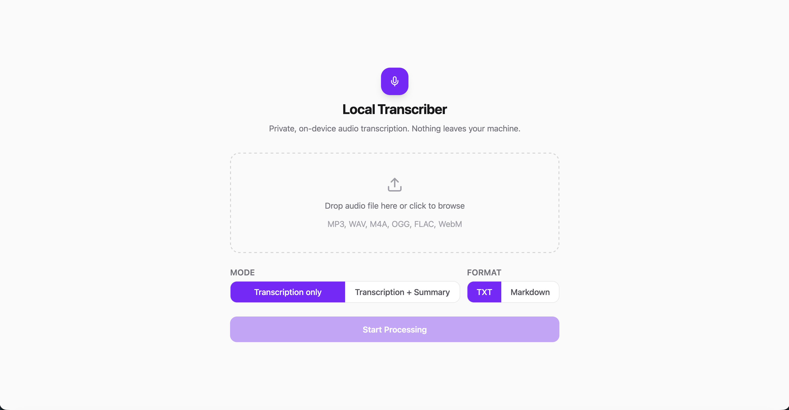

# Local Transcriber

Private, on-device audio transcription and summarization. No audio or text ever leaves your machine.



## Features

- Transcribe audio files (MP3, WAV, M4A, OGG, FLAC, WebM) using Whisper large-v3
- Optionally summarize transcripts using Phi-4 (14B) running locally via llama.cpp
- Download results as plain text or Markdown
- Jobs are queued and processed one at a time; temporary files are cleaned up automatically

## Requirements

- macOS (Apple Silicon recommended — Metal is used for Phi-4 inference)
- Python 3.11+
- Node.js 18+
- The Phi-4 Q8_0 GGUF model at `backend/models/phi-4-Q8_0.gguf` (~15.6 GB)

## First-time setup

```bash
# 1. Create and activate a Python virtual environment
python3 -m venv .venv
source .venv/bin/activate

# 2. Install Python dependencies
pip install -r backend/requirements.txt

# 3. Install llama-cpp-python with Metal support
CMAKE_ARGS="-DGGML_METAL=on" pip install llama-cpp-python

# 4. Install frontend dependencies
npm install --prefix frontend
```

Place your `phi-4-Q8_0.gguf` file at:
```
backend/models/phi-4-Q8_0.gguf
```

## Running

```bash
./start.sh
```

This starts both servers:
- Backend API: `http://localhost:8000`
- Frontend UI: `http://localhost:5173`

Open `http://localhost:5173` in your browser. The UI shows a loading spinner while models are initializing (typically 5–15 seconds), then presents the upload form.

Press **Ctrl+C** to stop both servers.

## Architecture

```
local-transcriber-app/
├── backend/
│   ├── main.py          # FastAPI app — routes, lifespan, background job runner
│   ├── job_store.py     # In-memory job store with threading.Lock and TTL cleanup
│   ├── transcriber.py   # Whisper large-v3 via faster-whisper (CTranslate2)
│   ├── summarizer.py    # Phi-4 Q8_0 via llama-cpp-python (Metal)
│   ├── models/          # GGUF model file (gitignored)
│   └── tmp/             # Ephemeral audio and output files (gitignored)
├── frontend/
│   └── src/
│       ├── App.tsx                      # State machine: loading → idle → processing → complete/error
│       └── components/
│           ├── UploadCard.tsx           # Drag-and-drop upload, format/mode toggles
│           ├── ProgressBar.tsx          # Polling /status every 2s, indeterminate then determinate
│           └── DownloadPanel.tsx        # Download trigger and reset
└── start.sh             # Starts uvicorn + Vite dev server, kill -9 on Ctrl+C
```

### Request flow

1. User selects a file, output format (TXT/Markdown), and mode (transcript only or transcript + summary)
2. `POST /transcribe` — file is saved to `backend/tmp/`, a job is created and queued
3. A background task acquires the inference semaphore (serializes jobs) and runs transcription in a thread pool executor so the event loop stays unblocked
4. If summarization is requested, Phi-4 runs after transcription completes
5. Frontend polls `GET /status/{job_id}` every 2 seconds; progress advances 0→80% during transcription, 80→100% during summarization
6. On completion, `GET /download/{job_id}` returns the file and schedules cleanup of all temporary files for that job

### Models

| Model | Purpose | Runtime | Approximate memory |
|---|---|---|---|
| Whisper large-v3 | Transcription | faster-whisper / CTranslate2 (CPU, int8) | ~3 GB |
| Phi-4 14B Q8_0 | Summarization | llama-cpp-python / Metal | ~15.6 GB |

### Known behavior

- **Transcription speed**: Whisper large-v3 on CPU processes audio in 30-second chunks. The progress bar shows an indeterminate pulse until the first chunk completes, then fills normally. Rough speed: 1–3× realtime on Apple Silicon.
- **Summarization**: Phi-4 must run with `verbose=True` in llama-cpp-python; `verbose=False` suppresses file descriptors in a way that breaks Metal inference on macOS.
- **Job queue**: Only one job runs at a time. A second upload while a job is in progress will queue and start automatically when the first finishes.
